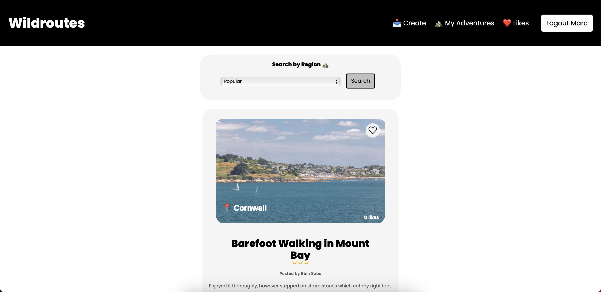
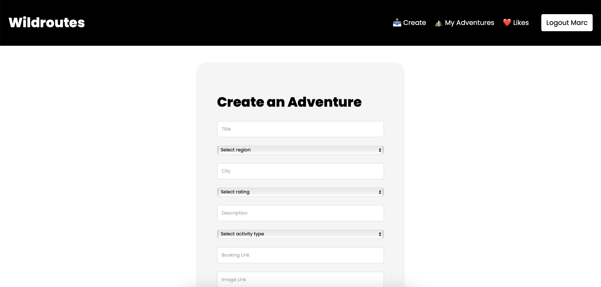

# Wildroutes
A fullstack web app that allows users to find nearest adventures using MERN.

## How to run
1. Download or clone the repo.
2. cd backend -> npm install -> npm run dev
3. cd frontend -> npm install -> npm start

## Screenshots

